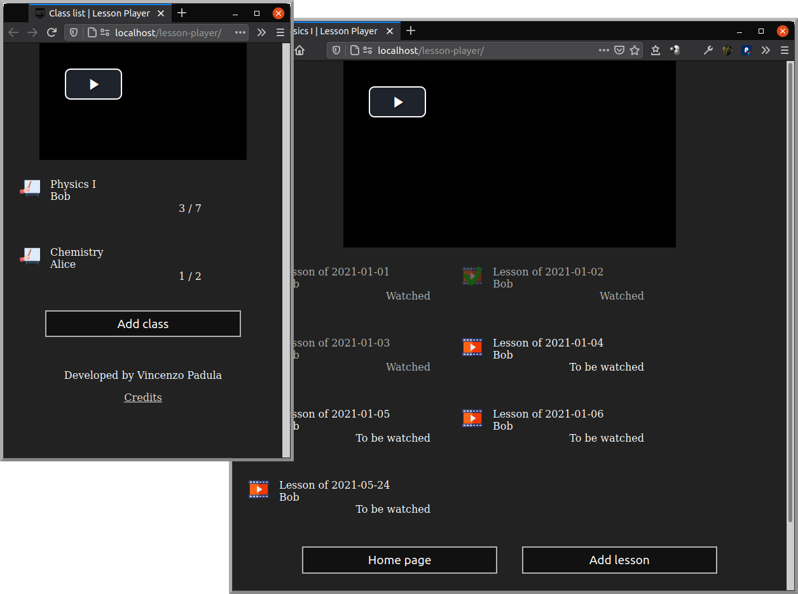
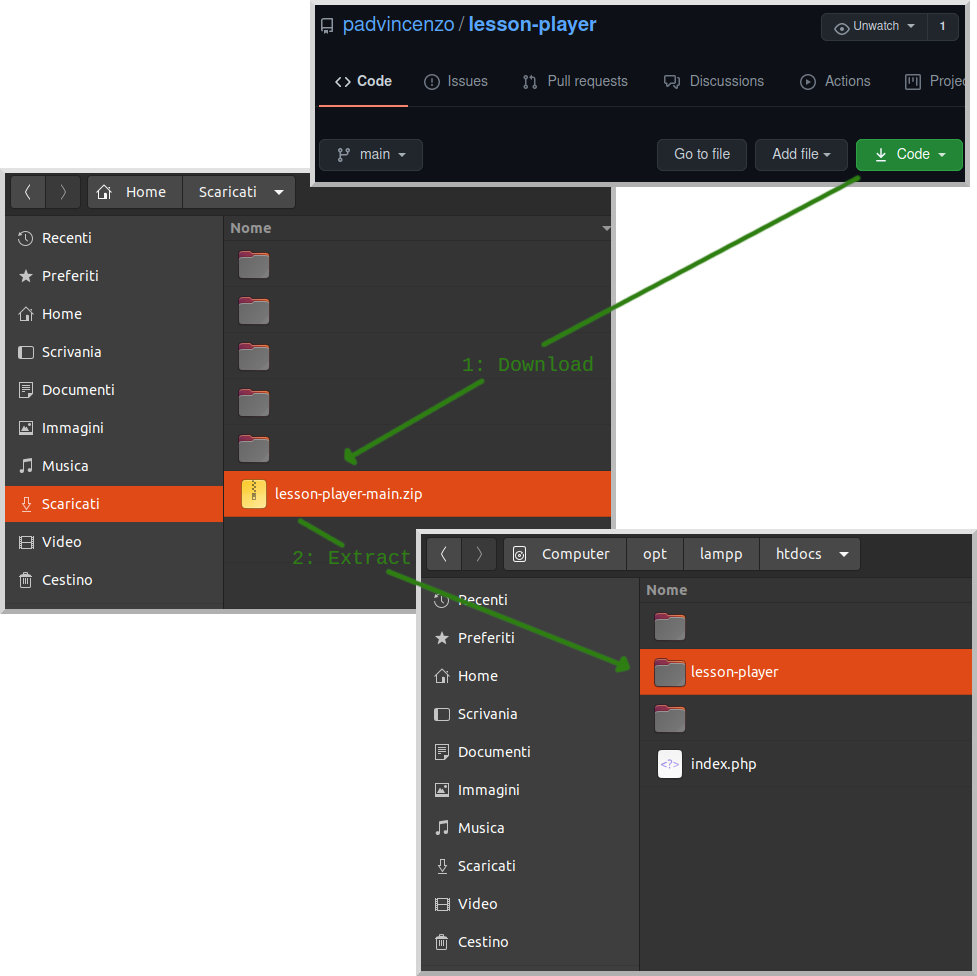
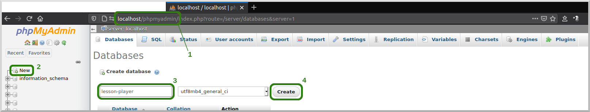
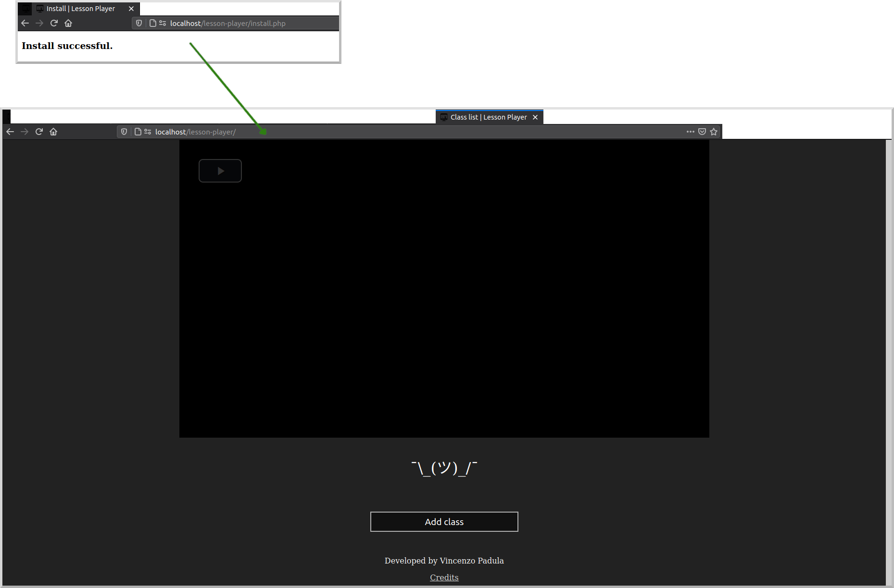
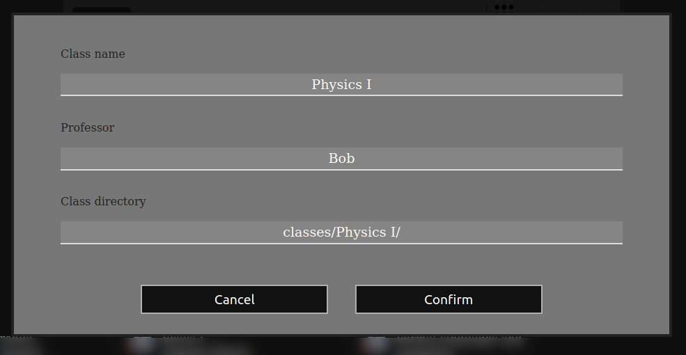
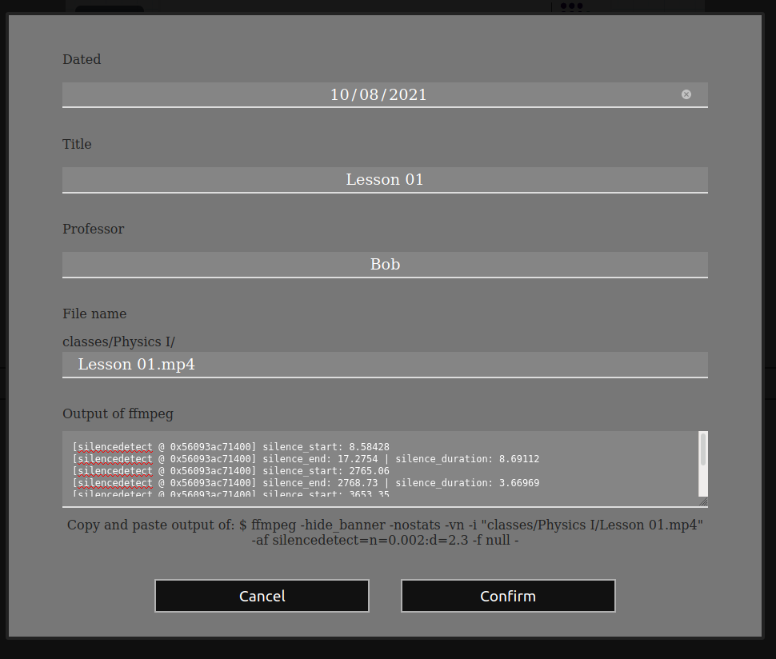

# Lesson Player
È un sito web (ma non è online) per guardare le video lezioni sulla rete locale: installandolo sul pc è possibile vedere le lezioni da tutti i dispositivi connessi.

Le sue principali caratteristiche sono:
1) Tiene traccia di dove sei arrivato (all'interno di un corso);
2) Velocizza (a 8x) il video durante i silenzi (quando il professore non parla).

*Leggi in altre lingue: [Inglese](README.md), Italiano.*



  - [Guida introduttiva](#guida-introduttiva)
    - [Installazione](#installazione)
    - [Aggiungere videolezioni](#aggiungere-videolezioni)
    - [Velocizzare i silenzi](#velocizzare-i-silenzi)
  - [Scorciatoie](#scorciatoie)
  - [Contribuire](#contribuire)
  - [FAQ](#faq)
  - [Crediti](#crediti)

I **feedback** sono molto apprezzati. Per favore, scrivimi una riga a *padvincenzo@gmail.com*

---

## Guida introduttiva

### Installazione
1) Scarica, installa e avvia [xampp](https://www.apachefriends.org/download.html).
2) Apri la cartella di xampp:
    * Su Linux: ``/opt/lampp/htdocs/``
    * Su Windows: ``C:\\xampp\htdocs\``
    * Su Mac: monta il volume Xampp e apri la cartella ``htdocs``
3) Crea una cartella (es: ``lesson-player/``) e copia tutti i file al suo interno.



4) Apri il browser all'indirizzo ``http://localhost/phpmyadmin/`` e crea un nuovo database (es: ``lesson-player``).



5) Dalla cartella di xampp apri il file ``_connect.php`` e aggiorna le credenziali del database (e volendo anche la lingua):

```php
include("languages/<linguaggio>.php");

// Credenziali del database
$host = "localhost";         // Indirizzo IP del database. Se usi xampp è: "localhost"
$user = "root";              // Il tuo username per accedere al database. Se usi xampp è: "root"
$password = "";              // La tua password per accedere al database. Se usi xampp è: "" (vuoto)
$database = "lesson-player"; // Il nome che hai dato al tuo database.

/* ... */
```

6) **Solo per nuovi utenti**: dal browser vai all'indirizzo ``http://localhost/<nome_cartella>/install.php`` (es: ``http://localhost/lesson-player/install.php``). Questo script cancellerà tutti i dati presenti nel database, se esistono.



7) *(Opzionale)* Imposta xampp per l'avvio automatico all'avvio del pc.

### Aggiungere videolezioni
1) Nella cartella ``.../htdocs/lesson-player/`` crea una sottocartella (es: ``classes/``) e copia qui tutte le videolezioni, organizzate in una struttura tipo:

```
lesson-player/
    classes/
        Physics I/
            Lesson 01.mp4
            Lesson 02.mp4
            ...
        Chemistry/
            Lesson 2021-01-01.mp4
            Lesson 2021-01-02.mp4
            ...
        ...
```

  * Nota: le cartelle e i file dentro la cartella ``classes`` possono anche essere collegamenti.
2) Apri il browser all'indirizzo ``http://localhost/lesson-player/``;
3) Inserisci tutti i corsi: nome, professore, percorso della cartella (es: ``classes/Physics I/``, notare lo ``/`` alla fine);



4) Torna alla pagina principale;
5) Seleziona un corso e premi il pulsante ``Mostra``;
6) Inserisci tutte le videolezioni appartenenti a quel corso: data, titolo, nome del file (es: ``Lesson 01.mp4``).



### Velocizzare i silenzi
Per ogni lezione è possibile trovare e velocizzare i silenzi, tramite ``ffmpeg``:
1) Scarica e installa [ffmpeg](https://ffmpeg.org/);
2) Apri il terminale (o il prompt dei comandi);
3) Spostati nella cartella ``../lesson-player/`` tramite il comando ``cd <cartella_xampp>/htdocs/lesson-player/``;
4) Esegui ffmpeg con il filtro ``silencedetect``, come indicato nel form di creazione/modifica della videolezione. Es:

```sh
ffmpeg -hide_banner -nostats -vn -i "classes/Physics I/Lesson 01.mp4" -af silencedetect=n=0.002:d=2.3 -f null -
```

5) Copia e incolla l'output nel form di modifica/aggiunta della videolezione. Esempio di output che ffmpeg genera:

```
...
[silencedetect @ 0x56093ac71400] silence_start: 8.58428
[silencedetect @ 0x56093ac71400] silence_end: 17.2754 | silence_duration: 8.69112
[silencedetect @ 0x56093ac71400] silence_start: 2765.06
[silencedetect @ 0x56093ac71400] silence_end: 2768.73 | silence_duration: 3.66969
[silencedetect @ 0x56093ac71400] silence_start: 3653.35
[silencedetect @ 0x56093ac71400] silence_end: 3657.01 | silence_duration: 3.66175
[silencedetect @ 0x56093ac71400] silence_start: 4347.37
[silencedetect @ 0x56093ac71400] silence_end: 4349.95 | silence_duration: 2.58562
[silencedetect @ 0x56093ac71400] silence_start: 4424.87
[silencedetect @ 0x56093ac71400] silence_end: 4429.57 | silence_duration: 4.69538
[silencedetect @ 0x56093ac71400] silence_start: 4475.08
[silencedetect @ 0x56093ac71400] silence_end: 4478.69 | silence_duration: 3.61456
[silencedetect @ 0x56093ac71400] silence_start: 4961.04
[silencedetect @ 0x56093ac71400] silence_end: 4965.18 | silence_duration: 4.14791
...
```

  * Si possono anche apportare modifiche al filtro, ma per un corretto funzionamento la durata minima dei silenzi (``d``) deve essere > 2.25. [Perché?](#perché-la-durata-minima-dei-silenzi-deve-essere-maggiore-di-225s)

Per velocizzare questa operazione ho creato due piccoli script, [uno per Linux](https://github.com/padvincenzo/lesson-player/blob/main/scripts/silences.sh) e [uno per Windows](https://github.com/padvincenzo/lesson-player/blob/main/scripts/silences.bat). Entrambi eseguono il filtro su tutte le videolezioni presenti nella cartella da cui sono eseguiti, e salvano il risultato in un file di testo dallo stesso nome della videolezione (vanno perció copiati ed eseguiti dalla directory che contiene le lezioni).

## Scorciatoie
Scorciatoie da tastiera:

|        **Tasto/i**      |               **Effetto**              |
|:-----------------------:| -------------------------------------- |
| ``Spazio``              | Pausa/play                             |
| ``M``                   | Muto/sonoro                            |
| ``F``                   | Video a schermo intero                 |
| ``Freccia a sinistra``  | Riavvolgi 5s (1m con ``Ctrl``)         |
| ``Freccia a destra``    | Vai avanti di 5s (1m con ``Ctrl``)     |
| ``Freccia in alto``     | Alza il volume                         |
| ``Freccia in basso``    | Abbassa il volume                      |
| ``]`` o ``+`` (o ``=``) | Aumenta la velocità di riproduzione    |
| ``[`` o ``-``           | Diminuisci la velocità di riproduzione |
| ``S``                   | Salta il silenzio in corso             |
| ``Shift+S``             | Screenshot                             |
| ``O``                   | Abilita/disabilita overlay             |

Altri tipi di scorciatoie:
* I riquadri dei corsi e delle lezioni sono indicizzate e scorribili con il tasto ``Tab``. Premendo ``Invio`` su una di esse, partirà la relativa lezione. Lo stesso effetto si ottiene facendo doppio click.

## Contribuire
Chiunque può contribuire a questo progetto, in diversi modi:
* Traducendo il progetto in [altre lingue](https://github.com/padvincenzo/lesson-player/tree/main/languages);
* Condividendo [nuovi temi](https://github.com/padvincenzo/lesson-player/tree/main/themes);
* Scovando e segnalando/risolvendo bug;
* Suggerendo nuove idee;
* Implementando nuove funzionalità;
* ***Inviando feedback***.

In altre parole, crea una fork e divertiti a scrivere codice. Quando avrai qualcosa che possa migliorare il progetto, apri la tua pull request.

Per qualunque dubbio o perplessità possiamo discuterne sulla [pagina apposita](https://github.com/padvincenzo/lesson-player/discussions).

## FAQ

#### Perché la durata minima dei silenzi deve essere maggiore di 2.25s?
Alla velocità *8x*, preimpostata per i silenzi, il tempo del video si aggiorna ogni circa *2s*. Per ovviare questo problema, quando carichi i tempi di silenzio che genera ffmpeg, il server rimuove un margine di *2s* dalla fine del silenzio, e ne aggiunge uno di *0.25s* dall'inizio. Impostando una durata ``d`` minore di *2.25s*, il server riconoscerà questi silenzi con una durata ``(d - 2.25) ≤ 0``, pertanto saranno ignorati. È possibile modificare questi margini dal file ``/ajax/lesson.php``, all'interno della funzione ``insertSilences()`` (variabili ``$marginLeft`` e ``$marginRight``), ma ciò potrebbe causare effetti indesiderati.

```php
function insertSilences() {
  /* ... */

  $marginLeft = 0.25; // Secondi di margine dopo l'inizio del silenzio
  $marginRight = 2;   // Secondi di margine prima della fine del silenzio

  /* ... */
}
```

#### Voglio che vengano riconosciuti e velocizzati anche i silenzi più brevi, come posso fare?
Sfortunatamente, ciò non è possibile senza una ricodifica del video stesso. Pensando proprio a questo ho sviluppato un altro programma: [silence-speedup](https://github.com/padvincenzo/silence-speedup). Spero possa esserti utile.

#### Voglio cambiare la velocità di riproduzione minima/massima/durante i silenzi, come posso fare?
Apri il file ``/js/player.js`` e modifica i seguenti valori:

```js
class Player {
  /* ... */

  static fastPlaybackRate = 8;  // Velocità di riproduzione durante i silenzi
  static minPlaybackRate = 0.5; // Velocità di riproduzione minima
  static maxPlaybackRate = 3;   // Velocità di riproduzione massima
  
  /* ... */
}
```

Dopo di ché ricarica la pagina.

## Crediti
* Il sito fa uso della libreria [``video.js``](https://videojs.com/) e una versione modificata del [tema _city_](https://github.com/videojs/themes);
* Le icone sono prese da [www.flaticon.com](https://www.flaticon.com/).


[](https://www.paypal.com/paypalme/VincenzoPadula)
