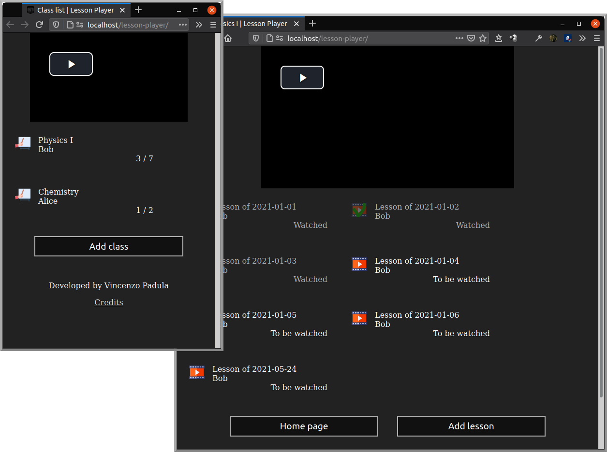
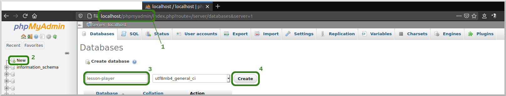
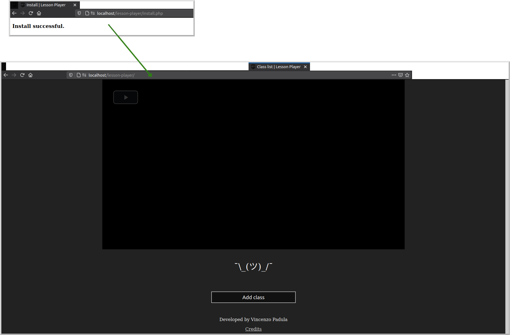
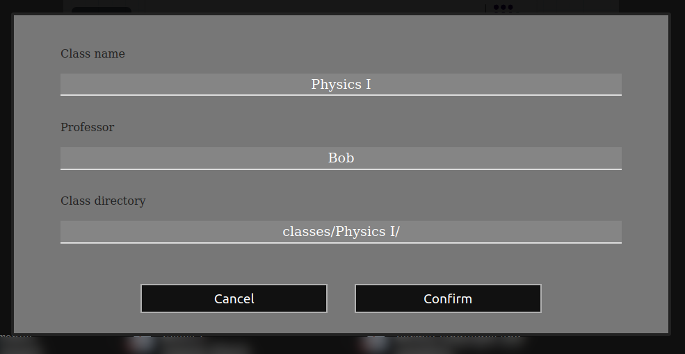
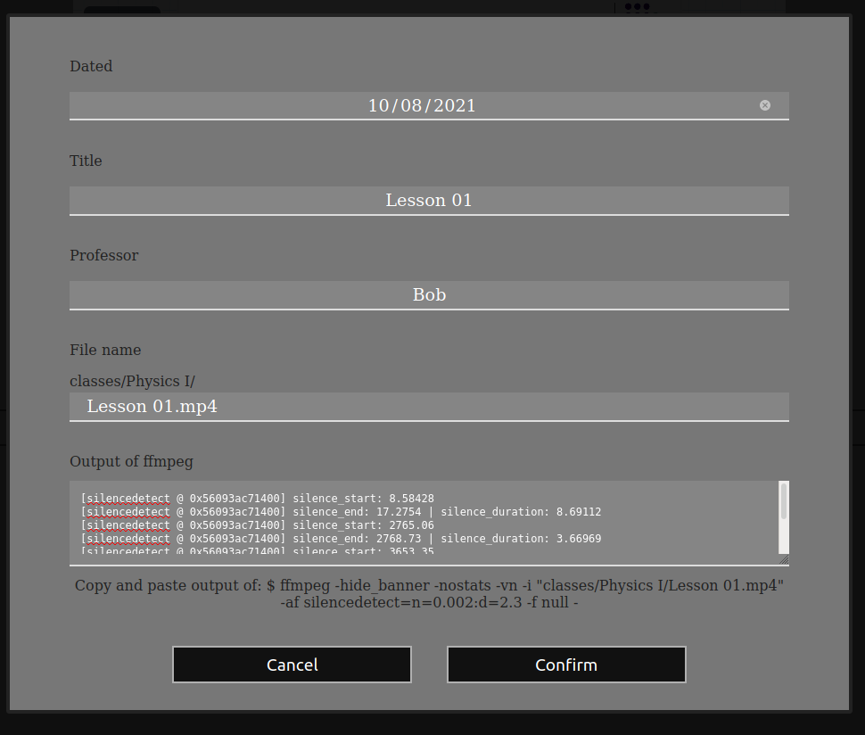

# Lesson Player
Lesson Player it's a website (but not online) for watching video lessons on the local network: by installing it on your pc, you can watch your lessons from all devices connected.

Main features are:
1) Keep track of which lessons you have watched (within a course);
2) Speed up (at 8x) the video during silences (when the teacher does not speak).

Are you enjoying this project? Please write me your opinion at [padvincenzo@gmail.com](mailto:padvincenzo@gmail.com) or leave a comment at [vincenzopadula.altervista.org/lesson-player/](https://vincenzopadula.altervista.org/lesson-player/), thank you.

*Read what follows in other languages: English, [Italian](README.it.md).*

---

## Update to version v0.4.0

Run this script from phpmyadmin

```sql
ALTER TABLE class ADD removed BOOLEAN NOT NULL DEFAULT false;
ALTER TABLE lesson ADD removed BOOLEAN NOT NULL DEFAULT false;
```

---



  - [Getting started](#getting-started)
    - [Install](#install)
    - [Add video lessons](#add-video-lessons)
    - [Speed up silences](#speed-up-silences)
  - [Shortcuts](#shortcuts)
  - [Contributing](#contributing)
  - [FAQ](#faq)
  - [Credits](#credits)

**Feedbacks** are highly appreciated. Please, write me a line at *padvincenzo@gmail.com*

---

## Getting started

### Install
1) Download, install and run [xampp](https://www.apachefriends.org/download.html).
2) Open xampp folder:
    * On Linux: ``/opt/lampp/htdocs/``
    * On Windows: ``C:\\xampp\htdocs\``
    * On Mac: mount Xampp volume and open the folder ``htdocs``
3) Create a new folder (e.g.: ``lesson-player/``) and copy all files inside.


4) Open the browser at ``http://localhost/phpmyadmin/`` and create a new database (e.g.: ``lesson-player``).



5) From the xampp folder, open ``_connect.php`` and update the database credentials (and maybe the language):

```php
include("languages/<language>.php");

// Database credentials
$host = "localhost";         // IP address of the database. With xampp is: "localhost"
$user = "root";              // Your mysql username. With xampp is: "root"
$password = "";              // Your mysql password. With xampp is: "" (empty)
$database = "lesson-player"; // The name of your database

/* ... */
```

6) **Only for new users**: from the browser go to ``http://localhost/<folder_name>/install.php`` (e.g.: ``http://localhost/lesson-player/install.php``). This script will drop all data in the database, if exist.



7) *(Optional)* Make xampp run at pc startup by default.

### Add video lessons
1) In the folder ``.../htdocs/lesson-player/`` create a subdirectory (e.g.: ``classes/``) and copy all your video lessons inside, arranged in a structure like:

```
lesson-player/
    classes/
        Physics I/
            Lesson 01.mp4
            Lesson 02.mp4
            ...
        Chemistry/
            Lesson 2021-01-01.mp4
            Lesson 2021-01-02.mp4
            ...
        ...
```

  * Note: folders and videos inside ``classes`` may also be links.
2) Open the browser at ``http://localhost/lesson-player/``;
3) Insert all your classes: name, professor, folder name (e.g.: ``classes/Physics I/``, notice the ``/`` at the end);



4) Go back to the homepage;
5) Select a class and press ``Show``;
6) Insert all lessons of the selected class: date of the lesson, title, file name (e.g.: ``Lesson 01.mp4``).



### Speed up silences
For each lesson it's possible to find and speed up silences, using ``ffmpeg``:
1) Download and install [ffmpeg](https://ffmpeg.org/);
2) Open the terminal (or prompt);
3) Move to the folder ``.../lesson-player/`` (e.g. using ``cd <xampp_folder>/htdocs/lesson-player/``);
4) Run ffmpeg with ``silencedetect`` filter, as shown in the form of creation/edit of a lesson. E.g.:

```sh
ffmpeg -hide_banner -nostats -vn -i "classes/Physics I/Lesson 01.mp4" -af silencedetect=n=0.002:d=2.3 -f null -
```

5) Copy & paste the output in the form of creation/edit of the lesson. Example of a ffmpeg output:

```
...
[silencedetect @ 0x56093ac71400] silence_start: 8.58428
[silencedetect @ 0x56093ac71400] silence_end: 17.2754 | silence_duration: 8.69112
[silencedetect @ 0x56093ac71400] silence_start: 2765.06
[silencedetect @ 0x56093ac71400] silence_end: 2768.73 | silence_duration: 3.66969
[silencedetect @ 0x56093ac71400] silence_start: 3653.35
[silencedetect @ 0x56093ac71400] silence_end: 3657.01 | silence_duration: 3.66175
[silencedetect @ 0x56093ac71400] silence_start: 4347.37
[silencedetect @ 0x56093ac71400] silence_end: 4349.95 | silence_duration: 2.58562
[silencedetect @ 0x56093ac71400] silence_start: 4424.87
[silencedetect @ 0x56093ac71400] silence_end: 4429.57 | silence_duration: 4.69538
[silencedetect @ 0x56093ac71400] silence_start: 4475.08
[silencedetect @ 0x56093ac71400] silence_end: 4478.69 | silence_duration: 3.61456
[silencedetect @ 0x56093ac71400] silence_start: 4961.04
[silencedetect @ 0x56093ac71400] silence_end: 4965.18 | silence_duration: 4.14791
...
```

  * You can also edit the filter, but in order to ensure the success of the program, the minimum duration of silences (``d``) must be > 2.25. [Why?](#why-should-the-minimum-silence-duration-be-greater-than-225s)

With the aim of saving time, I've written two little scripts, [one for Linux](https://github.com/padvincenzo/lesson-player/blob/main/scripts/silences.sh) and [one for Windows](https://github.com/padvincenzo/lesson-player/blob/main/scripts/silences.bat). They both run the filter on every video in the same folder where the script is executed, and save the result in a file with the same name of the video (so the script should be executed in the folder that contains the videos).

## Shortcuts
Hotkeys:

|         **Key(s)**        |           **Effect**          |
|:-------------------------:| ----------------------------- |
| ``Esc``                   | Close the current message     |
| ``Space``                 | Toggle play/pause             |
| ``M``                     | Toggle mute                   |
| ``F``                     | Toggle fullscreen             |
| ``Arrow left``            | Go back 5s (1m with ``Ctrl``) |
| ``Arrow right``           | Skip 5s (1m with ``Ctrl``)    |
| ``Arrow up``              | Increase volume               |
| ``Arrow down``            | Decrease volume               |
| ``]`` or ``+`` (or ``=``) | Increase playback rate        |
| ``[`` or ``-``            | Decrease playback rate        |
| ``S``                     | Skip current silence          |
| ``Shift+S``               | Screenshot                    |
| ``O``                     | Enable/disable overlay        |
| ``X``                     | Zoom/restore the video        |

Other types of shortcuts:
* Boxes of classes and lessons are tabindexed and scrollable with ``Tab`` key. Pressing ``Enter`` on a box, it will start the relative lesson. Same effect by double-clicking a box.

## Contributing
Anyone can contribute to this project, in many ways:
* Translating the project in [other languages](https://github.com/padvincenzo/lesson-player/tree/main/languages);
* Sharing a [new theme](https://github.com/padvincenzo/lesson-player/tree/main/themes);
* Finding and/or fixing bugs;
* Suggesting new ideas;
* Implementing new functionalities;
* ***Giving feedback***.

In other words, fork this project and have fun coding. When you think something you wrote can improve this project, open your pull request.

For any doubt or perplexity we can [discuss here](https://github.com/padvincenzo/lesson-player/discussions).

## FAQ

#### Why should the minimum silence duration be greater than 2.25s?
At *8x* speed, preset for silences, the video time updates every about *2s*. To work around this problem, when you load the silence times that ffmpeg generates, the server removes a *2s* margin from the end of the silence, and adds *0.25s* from the beginning. By setting a duration ``d`` less than *2.25s*, the server will recognize these silences with a duration ``(d - 2.25) ≤ 0``, therefore they will be ignored. You can change these margins from ``/ajax/lesson.php``, inside the ``insertSilences()`` function (``$marginLeft`` and ``$marginRight`` variables), but this could cause unwanted effects.

```php
function insertSilences() {
  /* ... */

  $marginLeft = 0.25; // Seconds after silence starts
  $marginRight = 2;   // Seconds before silence ends

  /* ... */
}
```

#### I want even the shortest silences to be recognized and speeded up, what can I do?
Unfortunately, this is not possible without re-encoding the video itself. Thinking about this, I developed another program: [silence-speedup](https://github.com/padvincenzo/silence-speedup). I hope it will be useful to you.

#### I want to change the minimum/maximum/silence playback rate, how can I do?
Open the file ``/js/player.js`` and edit the followings:

```js
class Player {
  /* ... */

  static fastPlaybackRate = 8;  // Playback rate on silences
  static minPlaybackRate = 0.5; // Slower playback rate
  static maxPlaybackRate = 3;   // Faster playback rate

  /* ... */
}
```

Then reload the page.

## Credits
* The website makes use of [``video.js``](https://videojs.com/) and a modified version of [theme _city_](https://github.com/videojs/themes);
* Icons are from [www.flaticon.com](https://www.flaticon.com/).


[](https://www.paypal.com/paypalme/VincenzoPadula)

